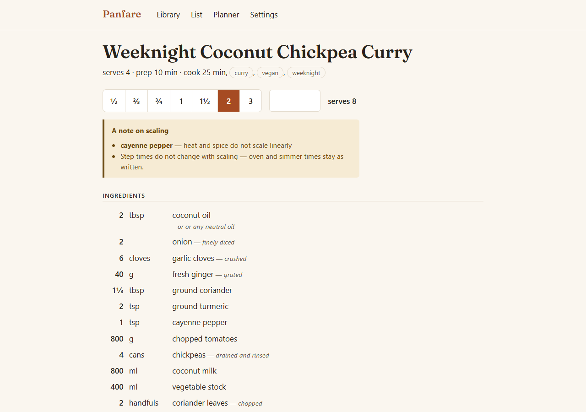
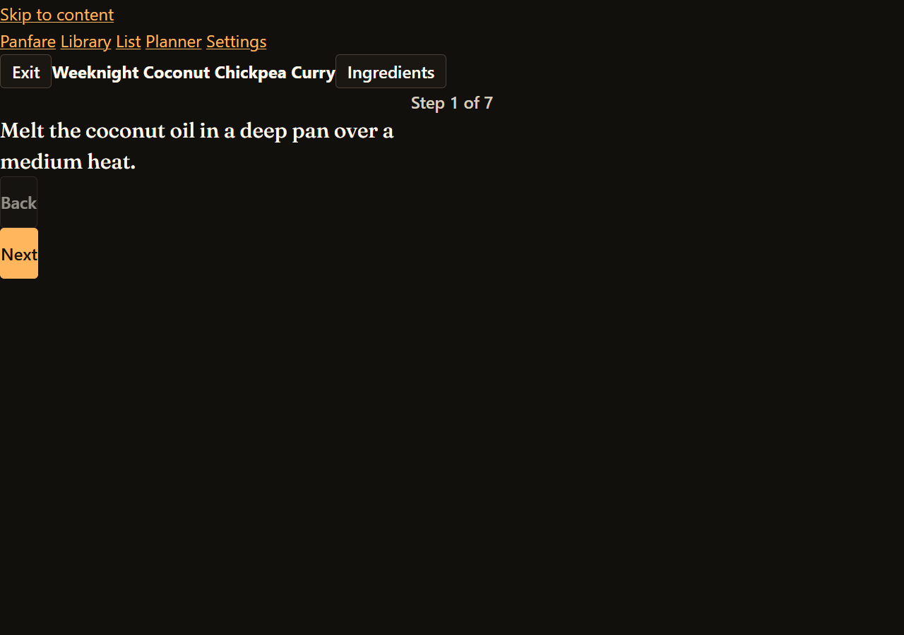
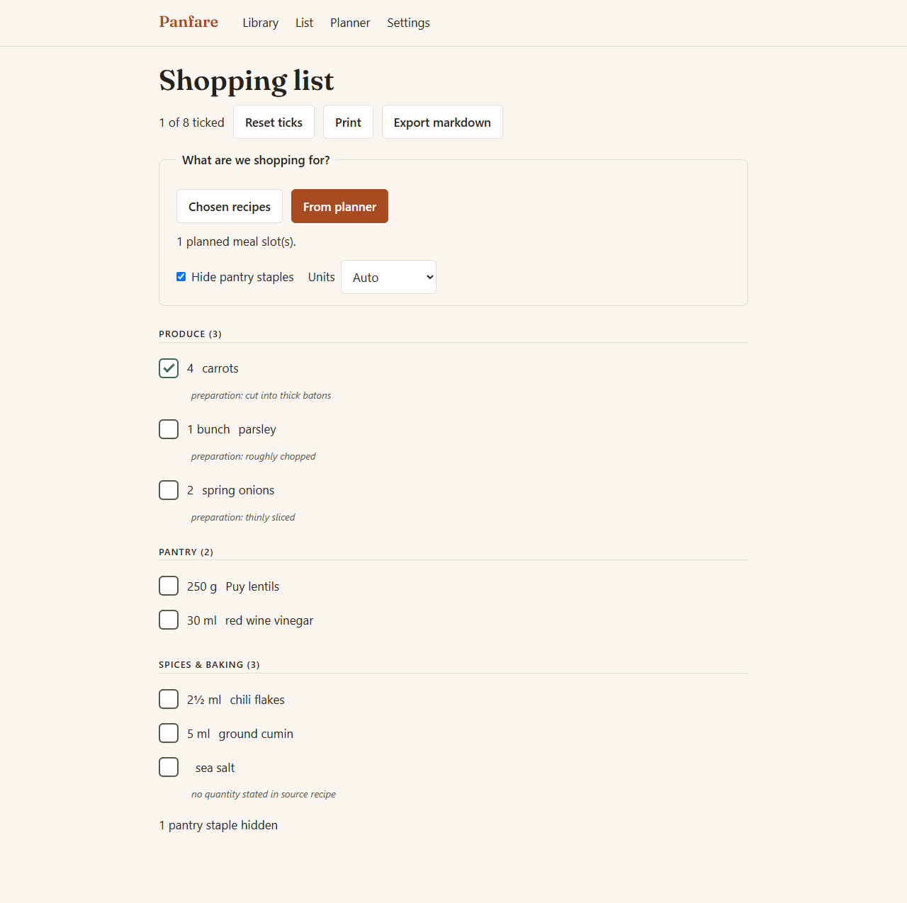

# Panfare

A local-first recipe manager for home cooks who plan meals for a week: enter recipes, scale them to any serving count with exact arithmetic, and merge everything into one shopping list.

No account, no server — your library lives in your browser's local storage, with one-click JSON backups you own.



## Install

```bash
git clone https://github.com/TheFadGhost/panfare.git
cd panfare
npm install
npm run dev          # http://localhost:5173
```

Requires Node 20.10+ (the dev server, tests and JSON import syntax). The app itself is buildless ES modules.

## Commands

| Command | What it does |
|---|---|
| `npm run dev` | Serve the app locally (port 5173) |
| `npm test` | Run the full unit/fixture suite (vitest) |
| `npm run regression` | Scale every sample recipe across 11 factors and merge; fails on any float drift or absurd output |
| `node tools/smoke.mjs` | Drive a headless browser through the whole user journey (needs Chrome) |

## How scaling works

Every amount is stored as an exact rational number (integer numerator/denominator), never a float. Scaling multiplies rationals, so thirds and eighths never drift: scale a recipe to ×⅓ three times and you get exactly the original back.

Display picks sensible units at each size — 3 tsp becomes 1 tbsp, 240 ml becomes 1 cup under imperial preference — and renders fractions as real glyphs (`½`, `1½`) or styled stacked fractions for odd denominators. When metric rounding must approximate (>2%), the value is marked with `≈` and keeps its exact value in the tooltip and screen-reader label.

**Conversion limits, stated plainly:**

- Volume↔volume and mass↔mass conversions are exact. Panfare uses kitchen-standard metric spoons/cups: 1 tsp = 5 ml, 1 tbsp = 15 ml, 1 fl oz = 30 ml, 1 cup = 240 ml.
- Mass uses exact avoirdupois definitions (1 lb = 453.59237 g).
- Volume↔mass conversion happens **only** for ingredients whose density Panfare knows (flour, butter, sugar, water, honey, oil, and others in `src/core/units.mjs`). These densities are cooking approximations, so such merged amounts are marked `≈`.
- Different countable units (cloves vs slices) are never cross-converted; unmergeable items stay separate on the list with the reason printed next to them.

## Non-linear scaling

Leavening, salt, spice and alcohol do not scale linearly in real cooking. Panfare still scales them (you can always adjust down) but shows a calm amber margin note listing each one, and never silently rewrites oven durations — times stay put and get flagged instead.

## Import behaviour

Settings → "Import a recipe from the web" fetches a URL and reads schema.org Recipe data (JSON-LD, including `@graph`, or microdata). Attribution (author/site/title/url) is preserved automatically.

Most recipe sites block browser cross-origin requests (CORS). That failure is expected and explained in the UI: open the page yourself, copy it, and paste the full HTML into the importer instead — the same parser runs over it. Pages without recipe markup fail cleanly with an explanation, never a silent guess.

## Architecture note: the quantity engine

`src/core/fraction.mjs` is the contract every module shares: quantities are reduced integer fractions `{n, d}`, arithmetic is integer-only, overflow throws rather than drifts, and nothing anywhere converts a quantity to a float. Units (`units.mjs`), formatting (`format.mjs`, including spoken `aria-label`s like "one and a half cups"), parsing (`parser.mjs`), scaling (`scaling.mjs`) and list merging (`shoppingList.mjs`) all build on it. `tools/regression.mjs` proves round-trip exactness across the whole sample set after every change.

## Screenshots

Cook mode — high-contrast, one step at a time:



Merged shopping list from the planner:



## Testing

384 automated tests cover fraction arithmetic (exactness, round-trips, overflow), unit conversion both directions plus density refusals, 42 original ingredient-line fixtures (unicode fractions, ranges, parentheticals, multi-word units, to-taste lines, uncertain flags), merge behaviour across units/preparations/dimensions, schema.org fixtures including clean no-recipe failure, export round-trips, and WCAG contrast for all theme role pairs. `npm test`, `npm run regression` and `node tools/smoke.mjs` together form the gate before any release.

## License

MIT
